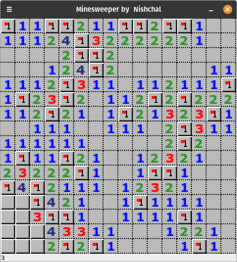
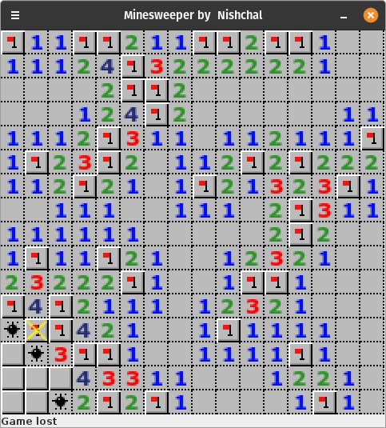

# Minesweeper in Java

A simple Java Swing program for the old-gold Minesweeper game. Just made for fun, don't take it seriously.

## To run
1. Clone the repository
2. Open terminal/ Command Prompt in the main directory
3. Do `javac Minesweeper.java` to compile
4. Do `java Minesweeper` to execute

## Screenshots:
#### Gameplay:

#### On Lose:

## Imperfections
1. Game board is initialized on start of application and not on 1st click [so don't expect your first click to be always safe]
2. Size of board and number of mines cannot be changed unless hardcoded.
3. Click on sweeped area with surronding mines marked does not sweep the neighbouring blocks.
 
 

Pull requests are welcomed.
